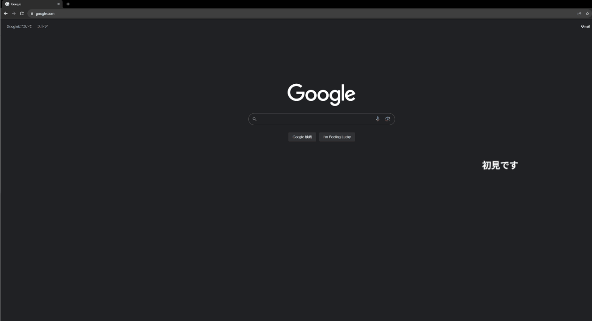

# slack-comment-screen
指定したSlackのスレッドに投稿されたメッセージをニコニコ動画の様に画面に流すツールです。
プレゼン中に参加者のコメントを拾う為に便利です。

# 使い方
1. Slack APIのトークンを取得する
    - Slackアプリを作ると取得できます
    - ボットトークンでもユーザートークンでも構いません
      - ボットトークンの場合はそのボットが監視対象のチャンネルに所属している必要があります
    - 監視対象がパブリックチャンネルなら`channel.history`、プライベートチャンネルなら`group.history`権限が必要です
2. 監視対象のスレッドのURLを取得する
    - スレッドの最初のメッセージをSlack上で右クリックして「リンクをコピー」すると取得できます
3. このアプリを起動する
4. 起動準備ウィンドウでSlack APIのトークンとスレッドのURLを入力する 
5. 「起動する」ボタンを押す
    - 入力されたトークンとスレッドのURLこの時点で端末に保存され、次回の起動時に復元されます
6. 監視対象のスレッドにメッセージを投稿する
    - 投稿されたメッセージが画面右端から左端に向かって流れます
7